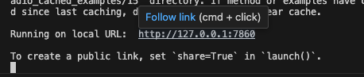
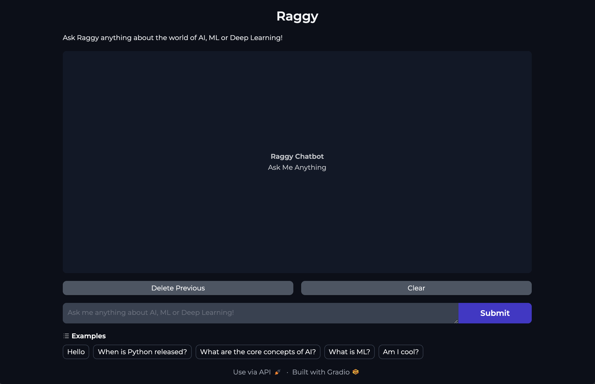

# Simple Retrieval-Augmented Generation (RAG) Application

## :bulb: About 

This application is a Retrieval-Augmented Generation (RAG) application using Google Cloud's Vertex AI and Wikipedia. It fetches, processes, and embeds documents to generate responses. Key features include fetching Wikipedia pages, collecting and formatting documents, initializing AI embeddings, and splitting text into chunks.

## :rocket: Getting Started

### Pre-requisites

- [Python](https://www.python.org/)
    > preferably `version==3.12.5`
- [Google Cloud](https://console.cloud.google.com/)
    > 1. With available credits  
    > 2. Project created
    > 3. Project Service API JSON key
- [Git](https://git-scm.com/)
- [pip](https://pypi.org/project/pip/)

### Setup 

1. Clone the repository

```zsh
git clone https://github.com/vancenceho/simple-rag-app.git
```

2. Navigate to project directory `<simple-rag-app>`

```zsh
cd <CLONE_DIR>/simple-rag-app
```

3. Create a virtual environment (**if you deem fit**)

```zsh
python -m venv venv

python3 -m venv venv
```

4. Activate virtual environment (if you have done **Step 3**)

```zsh
source .venv/bin/activate
```

3. Download the necessary packages

```zsh
pip install -r requirements.txt
```

4. Modify `rag_app.py` for own credentials

> At line 64, insert the Project ID of your own Google Cloud Project which you should have created beforehand, but if you have not feel free to check out this [link](https://developers.google.com/workspace/guides/create-project) to create it now.

```python
PROJECT_ID = "<YOUR_OWN_PROJECT_ID>"
```

> At line 65, insert the region which you have created your Google Cloud Project. Feel free to check out this [link](https://cloud.google.com/resource-manager/docs/creating-managing-projects#:~:text=Find%20the%20project%20name%2C%20number%2C%20and%20ID,-To%20interact%20with&text=Go%20to%20the%20Welcome%20page%20in%20the%20Google%20Cloud%20console.&text=From%20the%20project%20picker%20at,displayed%20in%20the%20project%20picker.) to find out where your Google Cloud Project reside in.

```python
REGION = "<PROJECT_REGION>"
```

> At line 66, insert your Google Cloud Project Service API JSON key, which you can download from the Google Cloud Console. Feel free to check out this [link](https://developers.google.com/workspace/guides/create-credentials) as to how to obtain it.

```python
CREDS_PATH = "<SERVICE_API_JSON_KEY_PATH>"
```

### Launch

1. Launch web-app `<RAGGY>`

```zsh
python app.py

python3 app.py
```

> Depends on which version of python you are currently using and whether it is alias-ed.

2. Navigate to web-app by pressing `CTRL+Click` / `CMD+Click` on shown URL or enter IP address in preferred web browser

```zsh
http://127.0.0.1:7860
```

An example of the terminal would look as followed: 



3. Meet `RAGGY`, your personal AI tech chatbot! :robot:

If you've the steps correctly, you should be able to meet **RAGGY** on your web browser as shown in below.  
Feel free to ask it about anything tech related! From programming languages, machine learning, artificial intelligence, and even natural language processing :) 



## :pray: Acknowledgements

This application was a side project I did while I was learning about RAG and Large Language Models (**LLMs**) during my internship at **[Ollion](https://ollion.com/)** as a **Junior Data Science Intern** in 
Fall 2024. 

All content and forms of documentation are credited to:  

Copyright &copy; 2024 _Vancence Ho_ &nbsp; | &nbsp; **Junior Data Science Intern** &nbsp; | &nbsp; Data Insights &nbsp; | &nbsp; **Ollion**

#